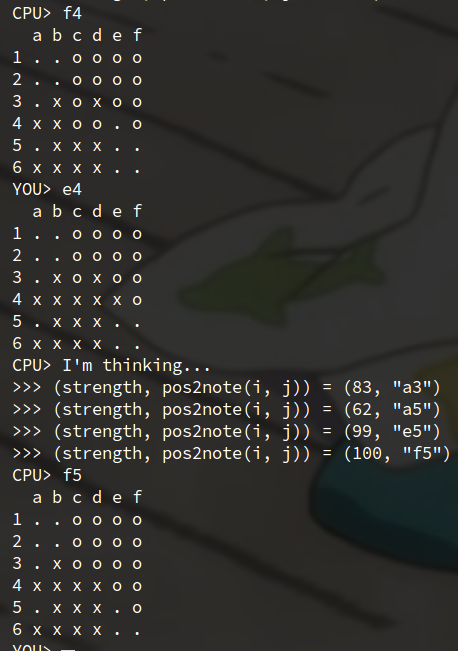

# 6x6 reversi

`6x6` is a basic tool for 6x6 reversi.

- commands:
    - solve
    - put
    - check

### `script/`

Under `script/`, there are some pretty toy script using `6x6`.

1.  `script/cli.sh`: You vs CPU game



2. `script/self.sh`: CPU vs CPU game (only watching)

## usage

```
6x6 solve < input
```

## `6x6` solve

`solve` searchs the best choice for the game.

### usage

### Input

The first line of the input is the next player of the game, `'o'` or `'x'`.

And the latter after 2nd line is a 6x6 board,
which is 6 lines and a line is 6 chars.
The char is one of `'.'`, `'o'` or `'x'`.
`'.'` is empty cell, `'o'` is the left player cell and `'x'` is the right player cell.

__N.B.__
`o` is assumed to be the first player of the game.

```
o
......
......
..ox..
..xo..
......
......
```

### Output

The output is the best choice of the next player,
and the board after put with the best choice.

```
b4
......
......
..ox..
.ooo..
......
......
```

#### N.B.

```
a1 b1 c1 d1 e1 f1
a2 b2 c2 d2 e2 f2
a3 b3 .. .. ..
a4 b4 .. ..
a5 .. ..
a6 b6 c6 d6 e6 f6
```

## put

`put` just displays the 6x6 board after put.

### Input

The first line is one of `'o'` or `'x'`.
The 2nd is the position,
and the latter is 6x6 board before put.

```
o
b4
......
......
..ox..
..xo..
......
......
```

### Output

If the position is valid, output is like the following.

```
ok
......
......
..ox..
.ooo..
......
......
```

### Input

```
o
a4
......
......
..ox..
..xo..
......
......
```

### Output

If invalid,

```
invalid
```

## check

`check` just checks whether the game is end,
and which player won when it's end.

### Input

```
......
......
..ox..
..xo..
......
......
```

### Output

```
yet
```

### Input

```
oooooo
oooooo
ooxxoo
ooxxoo
oooooo
oooooo
```

### Output

```
end
o
```


